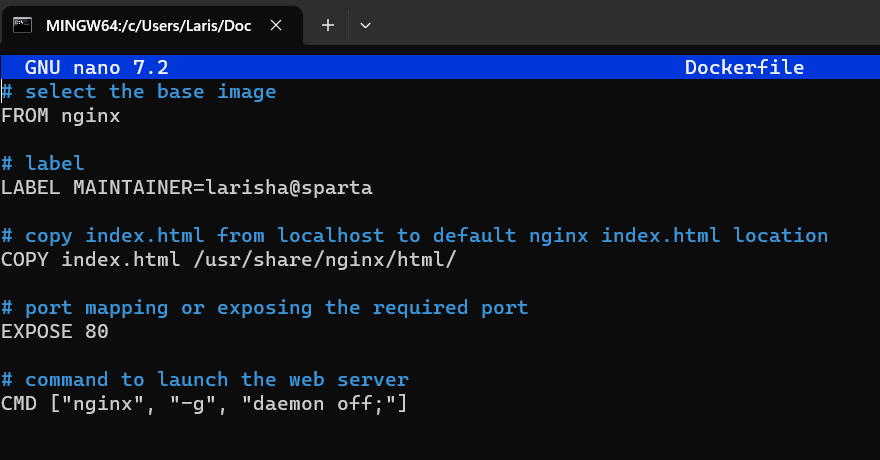
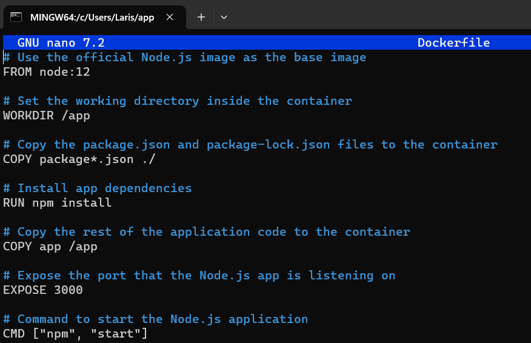

# Docker

Docker is a tool that allows you to create, manage, and run applications inside isolated environments called "containers." These containers are like lightweight virtual machines that package everything needed to run an application, including code, runtime, libraries, and system tools. 

Docker enables developers to easily build, ship, and deploy applications consistently across different environments, making it easier to develop, test, and deploy software without worrying about compatibility issues or conflicts with the host system. 

It helps streamline the development process and ensures that applications run reliably and consistently on any platform that supports Docker.


# Install Docker on Windows;

1. Download the Docker Desktop installer from the official Docker website.
   
2. Double-click the downloaded installer to start the installation process.
   
3. Follow the on-screen instructions to complete the installation and restart the computer.
   
4. Once installed, Docker Desktop should be accessible from the Start menu.

5. To check if it has been installed go to the Terminal and type the command docker --version. If installed correctly it will give you the version


# After installing Docker;

1. Go to start and search for Docker app 
2. Follow the link
3. Step 3: Enable Windows Subsystem for Linux (WSL)
Open PowerShell as Administrator and run the following command:
```
dism.exe /online /enable-feature /featurename:Microsoft-Windows-Subsystem-Linux /all /norestart
```
4. Step 6: Check if your Windows version supports WSL 2
Make sure you have Windows 10 version 1903 or later, or Windows 11. Check your version by pressing Windows logo key + R, type winver, and press Enter. Update Windows if needed.

5. Step 5: Enable Virtual Machine feature
In PowerShell as Administrator, run:
```
dism.exe /online /enable-feature /featurename:VirtualMachinePlatform /all /norestart
```

5. #### **Restart your computer after this step.**


6.  Set WSL 2 as the default version
Open PowerShell and run:
```
wsl --set-default-version 2
```

Now, WSL 2 is installed on your Windows machine and set as the default version. You can install Linux distributions from the Microsoft Store or other sources to use WSL 2.

# How does Docker API work?

The Docker API works over the internet using HTTP, and it follows the principles of REST, which means it uses standard web communication methods. 

Docker API provides a way for external tools and applications to communicate with Docker programmatically over HTTP. It allows developers to manage Docker containers, images, and other resources, making it easier to automate tasks and integrate Docker into their workflows.


# Steps of Creating Images on Docker

1. docker run hello-world: Run a test container to check if Docker is working. It displays a friendly message and exits.

2. docker ps: See the list of running containers (but "hello-world" container already exited, so it won't show here).

3. docker ps -a: Show all containers, including those that stopped.

4. docker run -d -p 80:80 nginx: Start a web server (Nginx) in the background, connecting host's port 80 to container's port 80.

5. docker ps: Now, you'll see the running Nginx container.

6. docker stop 67493e8af1ac: Stop the Nginx container with a specific ID.

7. docker start 67493e8af1ac: Restart the previously stopped Nginx container.

8. docker exec -it 67493e8af1ac sh: Enter the Nginx container's command line interactively.

9.  docker ps: both Nginx containers will be visible in the running containers list.

10. docker commit 67493e8af1ac lamatya/tech241-nginx:v1: Create a new image based on the first Nginx container's changes and tag it as "lamatya/tech241-nginx:v1."

11. docker images: View all Docker images, including the newly created.

12. docker push lamatya/tech241-nginx:v1: Upload the "lamatya/tech241-nginx:v1" image to Docker Hub to share it with others.

13. docker run -d -p 120:80 lamatya/tech241-nginx:v1: Start another instance of the "lamatya/tech241-nginx:v1" container on port 120 of the host, connected to port 80 of the container. This allows running multiple instances using the same image.

# Replace nginx default index.html 



# Copy Nodejs app to Docker
