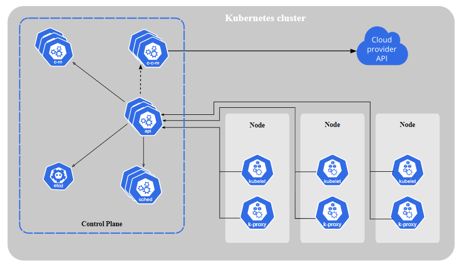
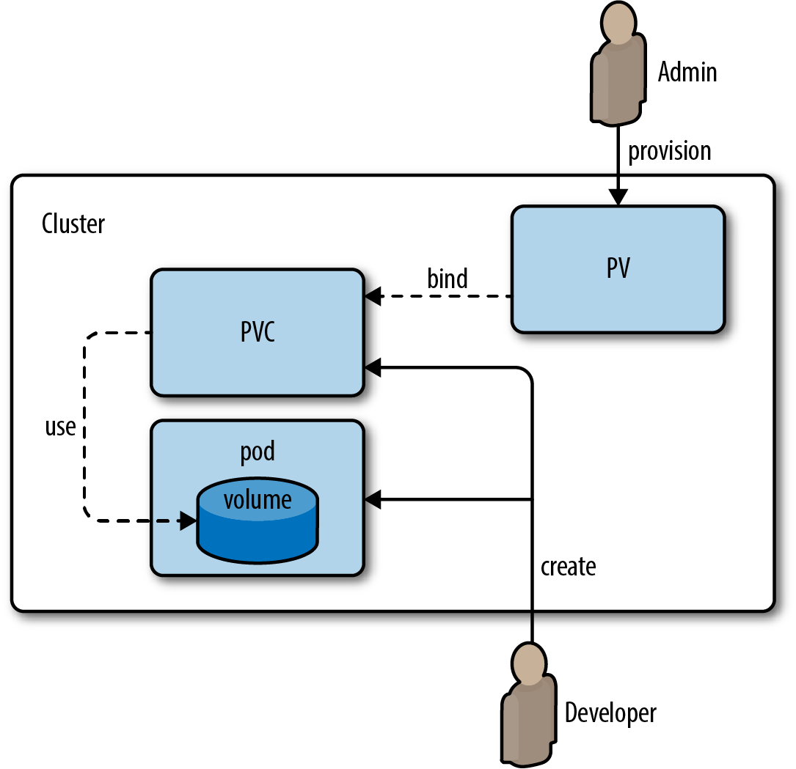

# Kubernetes

K8 is short for Kubernetes. It is a open source and is a powerful tool used in the world of technology to manage and orchestrate containerized applications. 
#


1. Master Node:The central control plane of the cluster.It Manages and controls all activities within the cluster.

2. kube-apiserver: The front end of the Kubernetes control plane that exposes the Kubernetes API and allows communication with the cluster.

3. etcd: A consistent and highly-available key-value store that stores all cluster data and is used as Kubernetes' backing store.

4. kube-scheduler: Watches for newly created Pods without assigned nodes and selects a suitable node for them to run on based on various factors.

5. kube-controller-manager: Manages controller processes that handle specific tasks like monitoring node health or managing jobs.

6. cloud-controller-manager: Embeds cloud-specific logic for interacting with the cloud provider's API, helping manage cloud-related resources.

7. kubelet: Runs on each node and ensures that containers in Pods are running and healthy.

8. kube-proxy: Acts as a network proxy on each node, maintaining network rules to allow communication to Pods from inside and outside the cluster.

# Why should we learn and use it?

1. Simplified Management: Kubernetes automates many tasks, making it easier to handle containers efficiently without manual effort.

2. Reliable and Always Available: Kubernetes ensures applications stay up and running by automatically replacing any failed containers.

3. Flexibility and Adaptability: It works with various containers and can run them on different servers or cloud environments.

4. Handles More Users: Kubernetes can scale up containers to handle increased demand, avoiding application crashes during traffic spikes.

5. Consistent Performance: It distributes work evenly among containers, maintaining stable performance even during busy times.

6. Cost Savings: Kubernetes optimizes server usage, saving money on hardware and cloud resources.
   

# Who is using it?
Various companies and organizations use Kubernetes, from small startups to large enterprises. 

- Google
- Microsoft
- Amazon Web Services (AWS)
- Apple
- Netflix
- Spotify
- PayPal
- Uber
- Airbnb

# Benefits to Business:

1. Efficiency: Kubernetes automates tasks, saving time and effort for developers and operations teams.

2. Faster Time-to-Market: Accelerates development and release cycles, enabling businesses to introduce new features and products faster.

3. Resource Optimization: Kubernetes optimizes resource usage, resulting in cost savings and better hardware utilization.

4. High Availability: Ensures applications are reliable and available, reducing downtime and improving user experience.

5. Flexibility: Allows deployment across different environments, making it easier to move applications between data centers and cloud providers.

6. Scalability: Scales applications dynamically, responding to changing demands and traffic patterns.
K8 Objects:

# K8 objects (Pods - Deployment - Services - replica sets)
1. Pods: A group of one or more containers deployed together on the same host, representing the smallest deployable unit in Kubernetes.

2. Deployments: Manages the lifecycle of pods, allowing you to create, update, or roll back application versions easily.

3. Services: Enables communication between different parts of the application, making it easy to access the right container.

4. Replica Sets: Ensures a specified number of identical pods are running, maintaining the desired number of copies.
   
# Concept of Labels and Selectors:

1. Labels: Tags attached to objects (e.g., pods, services) to identify and categorize them based on certain attributes (e.g., environment, app version).

2. Selectors: Allow objects to be selected based on specific labels. For example, a service can use a selector to connect to pods with matching labels.

# Build and Run the Image for nginx, mongodb and nodeapp
## Nginx
```
# select the base image
FROM nginx

# label
LABEL MAINTAINER=larisha@sparta

# copy index.html from localhost to default nginx index.html location
COPY index.html /usr/share/nginx/html/

# port mapping or exposing the required port
EXPOSE 80

# command to launch the web server
CMD ["nginx", "-g", "daemon off;"]
```
### Commands to run and build image for nginx
1. docker build -t lamatya/tech241-nginx:v1
2. docker run -d -p 27017:27017 lamatya/tech241-nginx:v1

## Mongodb

```# Base Image
FROM mongo:3.4

# Set working directory

WORKDIR /data

 

# Expose mongodb port

EXPOSE 27017

 

# Copy custom mongodb config file

COPY mongod.conf /etc/mongod.conf

```
### Commands to build and run the image for mongodb

1. docker build -t lamatya/tech241-mongodb:v1
2. docker run -d -p 27017:27017 lamatya/tech241-mongodb:v1

## Nodeapp
```
# Use the official Node.js image as the base image
FROM node:12

# Set the working directory inside the container
WORKDIR /app

# env variable
ENV DB_HOST=mongodb://172.17.0.4:27017/posts

# Copy the package.json and package-lock.json files to the container
COPY package*.json ./

# Install app dependencies
RUN npm install

# Copy the rest of the application code to the container
COPY app /app

# Expose the port that the Node.js app is listening on
EXPOSE 3000

# Command to start the Node.js application
CMD ["npm", "start"]
```
### Commands to build and run the nodeapp image

1. docker build -t lamatya/tech241-app:v1
2. docker run -d -p 27017:27017 lamatya/tech241-app:v1


# Commands to create nginx deploy;

1. **nano nginx-service.yml**: 

Opens the file nginx-service.yml in the nano text editor for editing.

1. **kubectl create -f nginx-service.yml:** 

Creates a Kubernetes service using the configuration defined in nginx-service.yml. The service allows access to Nginx pods within the Kubernetes cluster.

3. **kubectl get svc:** 

Lists all the Kubernetes services in the cluster,  including the Nginx service that was created.

# nginx-svc script

```
---
# Select the type of API version and type of service/object
apiVersion: v1
kind: Service
# Metadata for name
metadata:
  name: nginx-svc
  namespace: default # sre
# Specification to include ports selector to connect to the deployment
spec:
  ports:
  - nodePort: 30001 # range is 30000-32768
    port: 80
    targetPort: 80

# Lets define the selector and label to connect to nginx deployment
  selector:
    app: nginx # this label connects this service to deployment

  # Creating NodePort type of deployment
  type: NodePort # also use LoadBalancer - for local use cluster IP


```

# Commands to create node-service for the app

1. **nano node-service.yml:** 

Opens the file node-service.yml in the nano text editor for editing.

2. **kubectl create -f node-service.yml:** 
   
Creates a Kubernetes service using the configuration defined in node-service.yml. The service allows access to Node.js application pods within the Kubernetes cluster.

3. **kubectl get svc**: 

Lists all the Kubernetes services in the cluster, including the Node.js service that was created.

4. **kubectl delete svc node-svc**: 

Deletes a Kubernetes service named node-svc.

# nodejs-app-svc script

```
---

# Select the type of API version and type of service/object

apiVersion: v1

kind: Service

# Metadata for name

metadata:

  name: nodejs-app-svc

  namespace: default # sre

# Specification to include ports selector to connect to the deployment

spec:

  ports:

  - nodePort: 30002 # range is 30000-32768

    port: 3000

    targetPort: 3000

# Lets define the selector and label to connect to nginx deployment

  selector:

    app: nodejs-app # this label connects this service to deployment


  # Creating NodePort type of deployment

  type: NodePort # also use LoadBalancer - for local use cluster IP
```

# Connecting app to db

1. Creating Mongo Deployment - 

- **kubectl create -f mongo-k8.yml**
- **kubectl get deployment to check the status of deployment**

## Script for mongo-deployment
```
---
apiVersion: apps/v1
kind: Deployment
metadata:
  name: mongo
spec:
  selector:
    matchLabels:
      app: mongo
  replicas: 3
  template:
    metadata:
      labels:
        app: mongo
    spec:
      containers:
        - name: mongo
          image: lamatya/tech241-mongodb:v1
          ports:
            - containerPort: 27017
```
2. Create mongo Service

- **kubectl create -f mongo-service.yml**
- **kubectl get svc to check the status**

## script for mongo service
```
---
apiVersion: v1
kind: Service
metadata:
  name: mongo
spec:
  selector:
    app: mongo
  ports:
    - port: 27017
      targetPort: 27017
```
1. Creating node deployment

- **kubectl create -f node-k8.yml**
- **kubectl get deployemt**

## script for node deployment

```
---
# which api to use for deployment

apiVersion: apps/v1

 

# pod - service what kind of service/object to create

kind: Deployment

 

metadata:

  # naming the deployment

  name: nodejs-app-deployment

 

spec:

  selector:

    matchLabels:

      # look for this label to match with k8 service

      app: nodejs-app

 

  # create a replica set with instances/pods

  # 3 pods

  replicas: 3

 

  # template to use its label for k8 service to launch in the browser

  template:

    metadata:

      labels:

        # this label connects to the service or any other k8 components

        app: nodejs-app

   

    # define the container spec

    spec:

      containers:

      - name: nodejs-app

        image: lamatya/tech241-node-app:latest

        ports:

        - containerPort: 3000
        env:
          - name: DB_HOST
            value: mongodb://mongo:27017/posts
```
4. Creating node service

- **kubectl create -f node-service.yml**
- **kubectl get svc**
  
## script for Loadbalancer for the app
```
---

# Select the type of API version and type of service/object

apiVersion: v1

kind: Service

# Metadata for name

metadata:

  name: nodejs-app-svc

  namespace: default # sre

# Specification to include ports selector to connect to the deployment

spec:

  ports:

  - nodePort: 30002 # range is 30000-32768

    port: 3000

    targetPort: 3000

# Lets define the selector and label to connect to nginx deployment

  selector:

    app: nodejs-app # this label connects this service to deployment


  # Creating NodePort type of deployment

  type: NodePort # also use LoadBalancer - for local use cluster IP
```

### To seed the database use the command "*kubectl exec Node-pod-name -- node seeds/seed.js*"

And if everything is working it will let you go to local host and go to the port :30002 and the post page /posts. http://localhost:30002/posts


# Horizontal Pod Autoscaling (HPA)
1. Create a mongo-hpa.yml file.
```
---
apiVersion: autoscaling/v1
kind: HorizontalPodAutoscaler #(hpa)

metadata:
  name: sparta-mongo-db-deploy
  namespace: default
  
spec:
  maxReplicas: 6 #(max nuber of instances/pods)
  minReplicas: 3 #(min nuber of instances/pods)
  scaleTargetRef: # Targets the node deployment
    apiVersion: apps/v1
    kind: Deployment
    name: mongo
  targetCPUUtilizationPercentage: 50  # 50% of CPU use
```
2. Save and exit the file using Ctrl S and Ctrl X
3. Use the command kubectl create -f mongo-hpa.yml
4. Command kubectl get hpa to verify it has worked

# Volume, Persistent Volume (PV) and Persistent Volume Claim (PVC)



1. Administrator creates some Persistent Volumes in the Storage provider used by the organization.

2. User create Persistent Volume Claims and specifies the resources their application will be requiring in it.

3. After that user spins up PODs which will be running their specified applications in them.

4. The POD definition file will have PVC name specified in it which user created in Step 2

5. After being associated to the POD, PVC basically attaches that POD to the PV which it finds suitable according to the requirements specified by the user in that PVC.

### 1. **Persistent Volume (PV):**

  -  PV is like a storage drive or disk available in the Kubernetes cluster.
  - It exists independently and can be provisioned by the cluster administrators.
  - It can be dynamically allocated when needed or pre-allocated statically.
  - Multiple Pods can share the same PV.

### 2. Persistent Volume Claim (PVC):

  - PVC is a request for storage made by a Pod.
  - It asks for a specific amount of storage with certain properties, like read/write access and storage class.
  - Users don't need to worry about where the storage comes from; they just request it using PVC.
### 3. Volume:

  - A Volume is like a folder or directory available inside a Pod.
  - It provides temporary storage for data during the Pod's lifecycle.
  - When the Pod is deleted or rescheduled, the data stored in the Volume is lost.
### 4. Pod:

  - A Pod is the smallest unit in Kubernetes, representing one or more containers working together.
  - It can have Volumes attached to store data during the Pod's lifetime.
  - However, Volumes are temporary, and the data in them won't survive if the Pod is removed.
### Persistant Volume for mongo

```
apiVersion: v1
kind: PersistentVolume
metadata:
  finalizers:
  - kubernetes.io/pv-protection
  labels:
    type: local
  name: mongo-pv 
spec:
  accessModes:
  - ReadWriteOnce
  capacity:
    storage: 1Gi
  hostPath:
    path: /tmp/data
    type: ""
  persistentVolumeReclaimPolicy: Retain
  volumeMode: Filesystem
  storageClassName: manual
```
###  Persistent Volume Claim for Mongo
```
apiVersion: v1
kind: PersistentVolumeClaim
metadata:
  name: mongo-db
spec:
  accessModes:
    - ReadWriteOnce
  resources:
    requests:
      storage: 256Mi
```
# Creating 1 yml file to create multiple k8 objects
```
# PV for mongodb

---
apiVersion: v1
kind: PersistentVolume
metadata:
  finalizers:
  - kubernetes.io/pv-protection
  labels:
    type: local
  name: mongodb-pv 
spec:
  accessModes:
  - ReadWriteOnce
  capacity:
    storage: 1Gi
  hostPath:
    path: /tmp/data
    type: ""
  persistentVolumeReclaimPolicy: Retain
  volumeMode: Filesystem


# PVC for mongodb
---
apiVersion: v1
kind: PersistentVolumeClaim
metadata:
  name: mongodb-pvc
spec:
  accessModes:
    - ReadWriteOnce
  resources:
    requests:
      storage: 1Gi
 

# Deploy mongodb
---


apiVersion: apps/v1
kind: Deployment

metadata:
  name: mongodb-deployment
spec:
  selector:
    matchLabels:
      app: mongodb

  replicas: 3

  template:
    metadata:
      labels:
        app: mongodb

    spec:
      containers:
      - name: mongodb
        image: lamatya/tech241-mongodb:v1
        ports:
        - containerPort: 27017


# Mongodb service (SVC)

---
apiVersion: v1
kind: Service
metadata:
  name: mongodb
spec:
  selector:
    app: mongodb
  ports:
    - port: 27017
      targetPort: 27017


# Mongodb HPA autoscaling
---
apiVersion: autoscaling/v1
kind: HorizontalPodAutoscaler #(hpa)

metadata:
  name: sparta-mongo-db-deploy
  namespace: default
  
spec:
  maxReplicas: 6 #(max nuber of instances/pods)
  minReplicas: 3 #(min nuber of instances/pods)
  scaleTargetRef: # Targets the node deployment
    apiVersion: apps/v1
    kind: Deployment
    name: mongodb
  targetCPUUtilizationPercentage: 50  # 50% of CPU use


# App PV
---
apiVersion: v1
kind: PersistentVolume
metadata:
  finalizers:
  - kubernetes.io/pv-protection
  labels:
    type: local
  name: app-pv 
spec:
  accessModes:
  - ReadWriteOnce
  capacity:
    storage: 1Gi
  hostPath:
    path: /tmp/data
    type: ""
  persistentVolumeReclaimPolicy: Retain
  volumeMode: Filesystem


# App PVC
---
apiVersion: v1
kind: PersistentVolumeClaim
metadata:
  name: app-pvc
spec:
  accessModes:
    - ReadWriteOnce
  resources:
    requests:
      storage: 1Gi


# App Deploy
---
apiVersion: apps/v1
kind: Deployment

metadata:
  name: app-deployment
spec:
  selector:
    matchLabels:
      app: app

  replicas: 3

  template:
    metadata:
      labels:
        app: app

    spec:
      containers:
      - name: app
        image: lamatya/tech241-app:v1
        ports:
        - containerPort: 3000

# App service (SVC)
---
apiVersion: v1
kind: Service

metadata:
  name: app-svc
  namespace: default

spec:
  ports:
  - nodePort: 30002
    port: 3000
    targetPort: 3000

  selector:
    app: app

  type: NodePort


# Create an Autoscaling group for our node app HPA
---
apiVersion: autoscaling/v1
kind: HorizontalPodAutoscaler #(hpa)

metadata:
  name: sparta-app-deploy
  namespace: default
  
spec:
  maxReplicas: 6 #(max nuber of instances/pods)
  minReplicas: 3 #(min nuber of instances/pods)
  scaleTargetRef: # Targets the node deployment
    apiVersion: apps/v1
    kind: Deployment
    name: app
  targetCPUUtilizationPercentage: 50  # 50% of CPU use
```