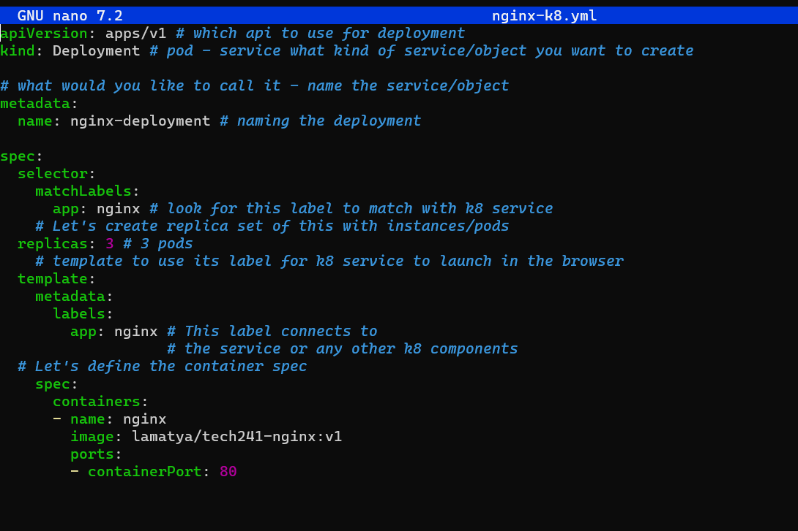
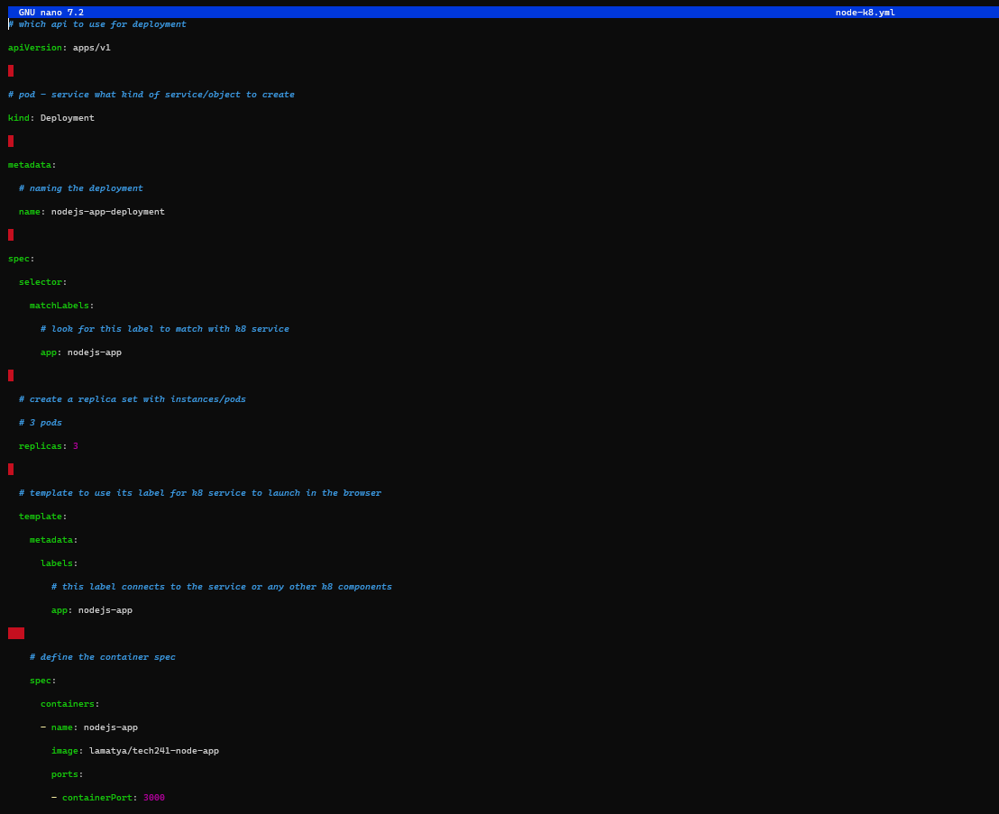

# Kubernetes

K8 is short for Kubernetes. It is a open source and is a powerful tool used in the world of technology to manage and orchestrate containerized applications. 
#


1. Master Node:The central control plane of the cluster.It Manages and controls all activities within the cluster.

2. kube-apiserver: The front end of the Kubernetes control plane that exposes the Kubernetes API and allows communication with the cluster.

3. etcd: A consistent and highly-available key-value store that stores all cluster data and is used as Kubernetes' backing store.

4. kube-scheduler: Watches for newly created Pods without assigned nodes and selects a suitable node for them to run on based on various factors.

5. kube-controller-manager: Manages controller processes that handle specific tasks like monitoring node health or managing jobs.

6. cloud-controller-manager: Embeds cloud-specific logic for interacting with the cloud provider's API, helping manage cloud-related resources.

7. kubelet: Runs on each node and ensures that containers in Pods are running and healthy.

8. kube-proxy: Acts as a network proxy on each node, maintaining network rules to allow communication to Pods from inside and outside the cluster.

# Why should we learn and use it?

1. Simplified Management: Kubernetes automates many tasks, making it easier to handle containers efficiently without manual effort.

2. Reliable and Always Available: Kubernetes ensures applications stay up and running by automatically replacing any failed containers.

3. Flexibility and Adaptability: It works with various containers and can run them on different servers or cloud environments.

4. Handles More Users: Kubernetes can scale up containers to handle increased demand, avoiding application crashes during traffic spikes.

5. Consistent Performance: It distributes work evenly among containers, maintaining stable performance even during busy times.

6. Cost Savings: Kubernetes optimizes server usage, saving money on hardware and cloud resources.
   

# Who is using it?
Various companies and organizations use Kubernetes, from small startups to large enterprises. 

- Google
- Microsoft
- Amazon Web Services (AWS)
- Apple
- Netflix
- Spotify
- PayPal
- Uber
- Airbnb

# Benefits to Business:

1. Efficiency: Kubernetes automates tasks, saving time and effort for developers and operations teams.

2. Faster Time-to-Market: Accelerates development and release cycles, enabling businesses to introduce new features and products faster.

3. Resource Optimization: Kubernetes optimizes resource usage, resulting in cost savings and better hardware utilization.

4. High Availability: Ensures applications are reliable and available, reducing downtime and improving user experience.

5. Flexibility: Allows deployment across different environments, making it easier to move applications between data centers and cloud providers.

6. Scalability: Scales applications dynamically, responding to changing demands and traffic patterns.
K8 Objects:

# K8 objects (Pods - Deployment - Services - replica sets)
1. Pods: A group of one or more containers deployed together on the same host, representing the smallest deployable unit in Kubernetes.

2. Deployments: Manages the lifecycle of pods, allowing you to create, update, or roll back application versions easily.

3. Services: Enables communication between different parts of the application, making it easy to access the right container.

4. Replica Sets: Ensures a specified number of identical pods are running, maintaining the desired number of copies.
   
# Concept of Labels and Selectors:

1. Labels: Tags attached to objects (e.g., pods, services) to identify and categorize them based on certain attributes (e.g., environment, app version).

2. Selectors: Allow objects to be selected based on specific labels. For example, a service can use a selector to connect to pods with matching labels.

# nginx using k8


# nodejs-app using k8


# Commands to create nginx services;

1. **nano nginx-service.yml**: 

Opens the file nginx-service.yml in the nano text editor for editing.

1. **kubectl create -f nginx-service.yml:** 

Creates a Kubernetes service using the configuration defined in nginx-service.yml. The service allows access to Nginx pods within the Kubernetes cluster.

3. **kubectl get svc:** 

Lists all the Kubernetes services in the cluster,  including the Nginx service that was created.

# nginx-svc script

```
---
# Select the type of API version and type of service/object
apiVersion: v1
kind: Service
# Metadata for name
metadata:
  name: nginx-svc
  namespace: default # sre
# Specification to include ports selector to connect to the deployment
spec:
  ports:
  - nodePort: 30001 # range is 30000-32768
    port: 80
    targetPort: 80

# Lets define the selector and label to connect to nginx deployment
  selector:
    app: nginx # this label connects this service to deployment

  # Creating NodePort type of deployment
  type: NodePort # also use LoadBalancer - for local use cluster IP


```

# Commands to create node-service for the app

1. **nano node-service.yml:** 

Opens the file node-service.yml in the nano text editor for editing.

1. **kubectl create -f node-service.yml:** 
   
Creates a Kubernetes service using the configuration defined in node-service.yml. The service allows access to Node.js application pods within the Kubernetes cluster.

3. **kubectl get svc**: 

Lists all the Kubernetes services in the cluster, including the Node.js service that was created.

1. **kubectl delete svc node-svc**: 

Deletes a Kubernetes service named node-svc.

# nodejs-app-svc script

```
---

# Select the type of API version and type of service/object

apiVersion: v1

kind: Service

# Metadata for name

metadata:

  name: nodejs-app-svc

  namespace: default # sre

# Specification to include ports selector to connect to the deployment

spec:

  ports:

  - nodePort: 30002 # range is 30000-32768

    port: 3000

    targetPort: 3000

# Lets define the selector and label to connect to nginx deployment

  selector:

    app: nodejs-app # this label connects this service to deployment


  # Creating NodePort type of deployment

  type: NodePort # also use LoadBalancer - for local use cluster IP

```

